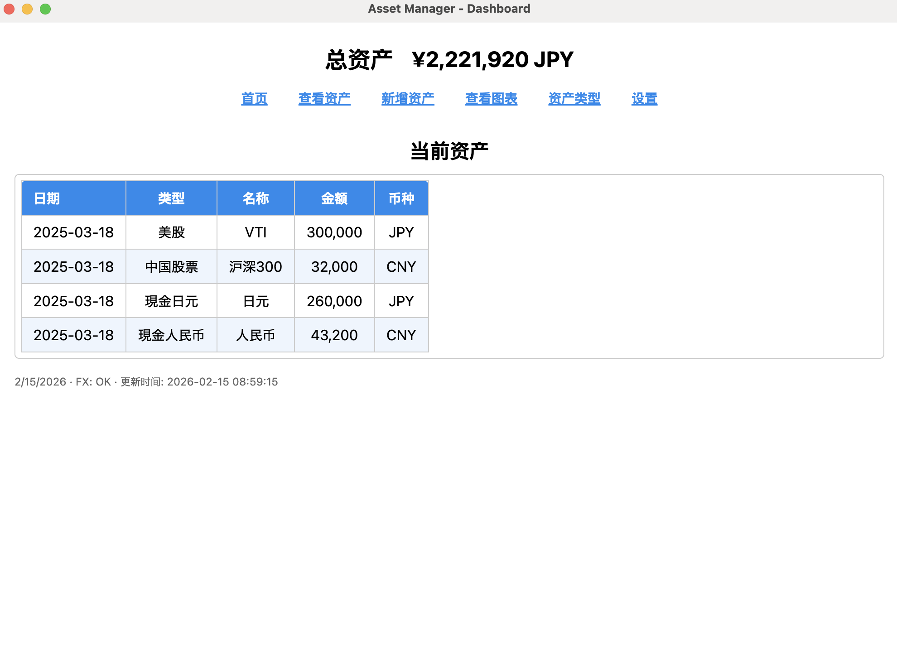

# Assets App

[中文](README.md) | [English](README.en.md) | [日本語](README.ja.md)




A local desktop personal asset management app built with Electron + SQLite (`sql.js`) + React.

## Features

- Asset record management (create, edit, delete, duplicate)
- Asset type management (create, edit, delete, with usage protection)
- Dashboard with latest-date assets and total amount
- Date-aggregated asset bar chart (Canvas)
- CNY -> JPY conversion for display (configurable)

## Tech Stack

- Electron 26
- SQLite (via `sql.js`)
- React 18 (local static runtime files)
- Vanilla CSS (MVP.css)

## Project Structure

```text
assets_app/
├─ main.js                     # Electron entry and IPC registration
├─ preload.js                  # secure bridge API (window.api)
├─ main/
│  ├─ assetService.js          # business logic
│  ├─ database.js              # sql.js wrapper and persistence
│  └─ config.js                # config (e.g. exchange rate)
├─ renderer/
│  ├─ dashboard.html
│  ├─ assets.html
│  ├─ add_asset.html
│  ├─ asset_types.html
│  ├─ chart.html
│  ├─ app-react.js             # React UI logic
│  ├─ vendor/                  # local React runtime files
│  └─ mvp.css
├─ data/
│  └─ assets.db                # SQLite database file
└─ docs/
   ├─ 01.SRS.md
   ├─ 02.HLD.md
   ├─ 03.DDL.md
   ├─ 04.LLD.md
   ├─ 05.UI 设计文档.md
   └─ ADR/
```

## Run Locally

### 1. Install dependencies

```bash
npm install
```

### 2. Start app

```bash
npm start
```

## Data

- Database file: `data/assets.db`
- Tables: `asset_types`, `assets`
- DB file is persisted after write operations

## Documentation

- Requirements: `/assets_app/docs/01.SRS.md`
- Architecture: `/assets_app/docs/02.HLD.md`
- Database: `/assets_app/docs/03.DDL.md`
- Low-level design: `/assets_app/docs/04.LLD.md`
- UI design: `/assets_app/docs/05.UI 设计文档.md`
- ADRs: `/assets_app/docs/ADR`

## Roadmap

- Unified error codes and error handling standard
- CSV export
- Backup/restore
- Filtering and pagination

## License

MIT
