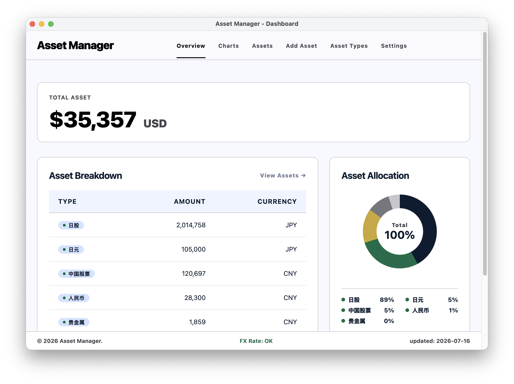
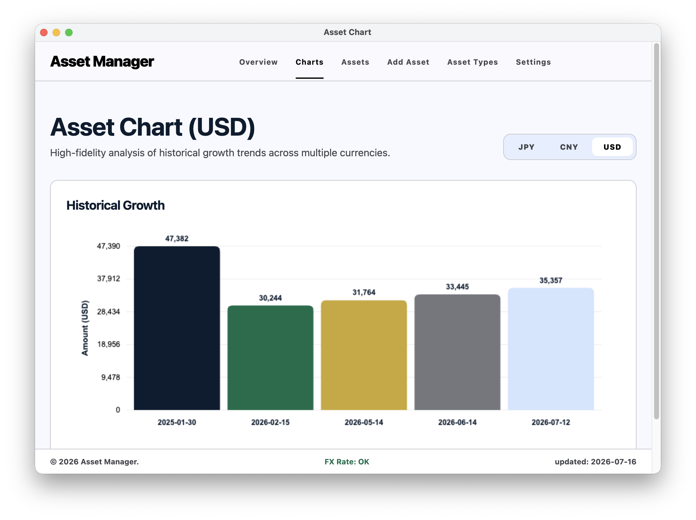

# Asset Manager

[中文](README.md) | [English](README.en.md) | [日本語](README.ja.md)




A local desktop personal asset management app built with Electron + SQLite (`sql.js`) + React. The app is designed around periodic asset snapshots: record portfolio values on different dates, convert totals into a display currency, and track changes through the Dashboard and Chart pages.

## Features

- Dashboard showing the latest-date asset snapshot and total asset value.
- Total asset calculation in the configured display currency, supporting `JPY`, `CNY`, and `USD`.
- Manual FX rate management used by Dashboard and Chart calculations.
- Asset record management: create, edit, delete, and duplicate.
- Asset type management: create, edit, delete, with a `Region` field.
- `Add New Rebalance`: copy the latest asset snapshot, keep asset types and currencies, and enter updated amounts for a new date.
- Date-aggregated asset bar chart rendered with Canvas.
- Settings for language, display currency, FX cache days, manual FX rates, local import, and local export.
- Local `.db` import validates database structure; older exported databases are migrated to the latest schema.
- Multilingual UI: Chinese, English, and Japanese.

## Data and Compatibility

- Data is stored in a local SQLite database.
- Development database path: `data/assets.db`.
- Packaged macOS apps use Electron's `userData` directory for `assets.db`.
- Database migrations live in `main/migrations/`.
- The legacy `assets.name` column is retained for compatibility, but Asset Name is no longer shown or edited in the UI.
- `asset_types.region` is a newer field and is added through migration when older databases are imported.

## Tech Stack

- Electron 26
- SQLite via `sql.js`
- React 18 with local static runtime files
- Canvas chart
- Vanilla CSS organized under `renderer/styles/`

## Project Structure

```text
main/                    Electron main process, database, and service logic
main/migrations/          SQLite migration SQL
preload.js                Safe APIs exposed to the renderer
renderer/*.html           HTML shells for each page
renderer/app-react.js     Thin React bootstrap entry point
renderer/src/             Renderer React modules
renderer/src/pages/       Page components such as Dashboard / Assets / Settings
renderer/src/components/  Shared app shell, navigation, and footer components
renderer/styles/          tokens / reset / base / layout / components / pages styles
openspec/changes/         Feature and refactor specifications
```

## Run Locally

### 1. Install dependencies

```bash
npm install
```

### 2. Start app

```bash
npm start
```

## Packaging

```bash
npm run pack
```

Build distributable installers:

```bash
npm run dist
```

## macOS DMG Note

If you installed from a GitHub Release `.dmg` and see “app is damaged and can’t be opened”, run:

```bash
xattr -dr com.apple.quarantine /Applications/Asset\ Manager.app/
```

## License

MIT
