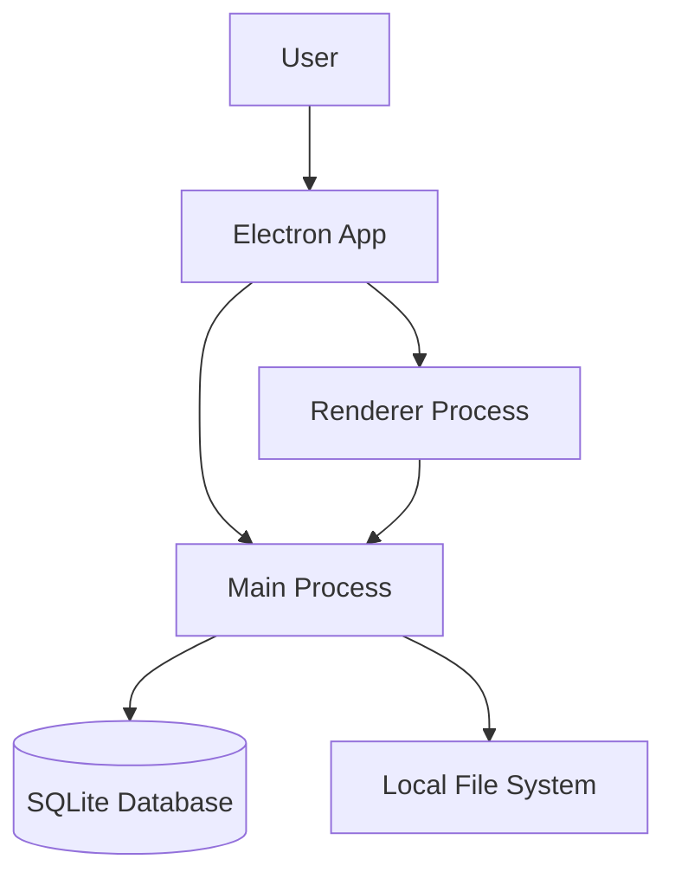
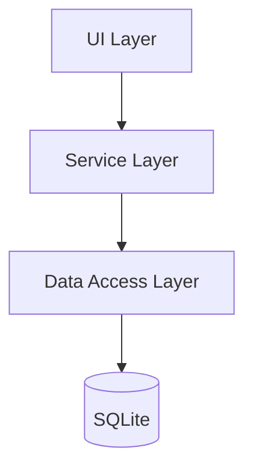
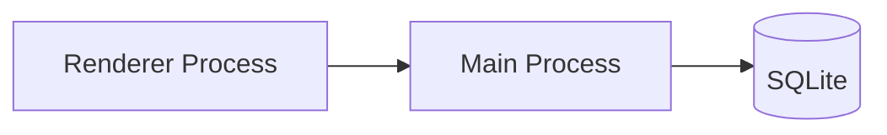
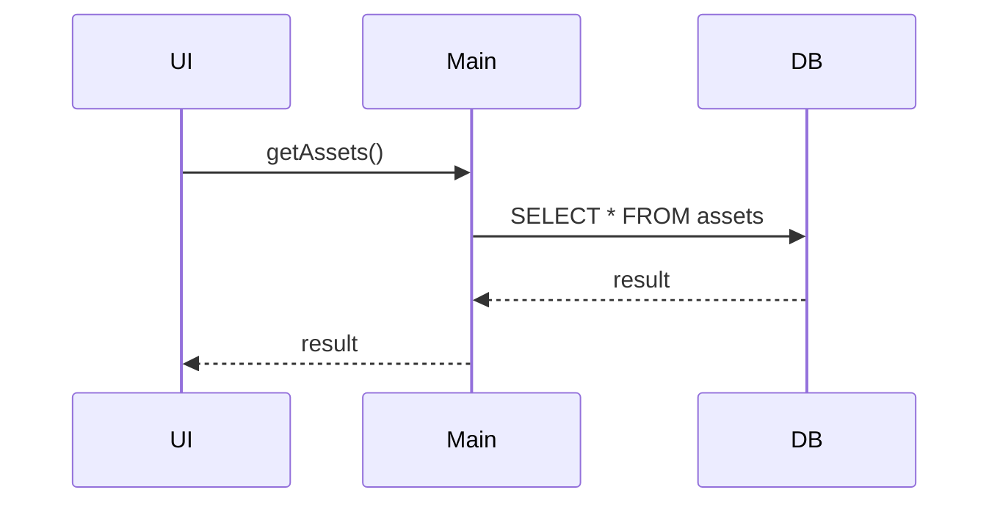
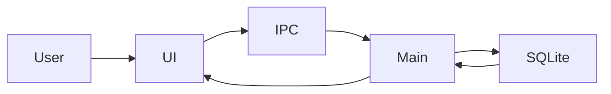
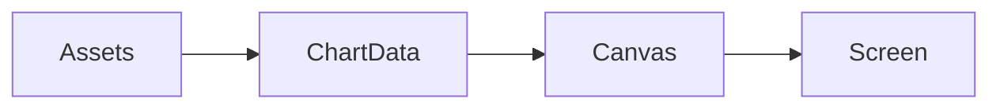
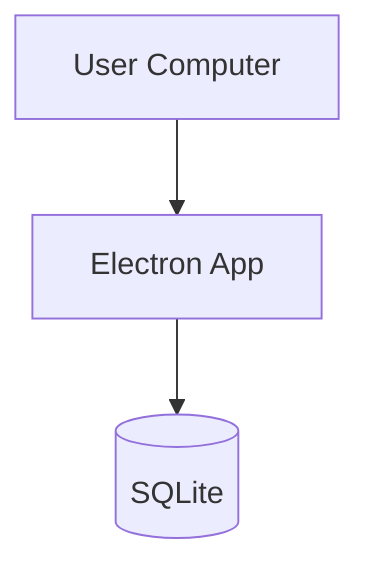

# 2️⃣ 系统架构设计书（High-Level Design, HLD）

---

# 系统架构设计书（HLD）

Personal Asset Management System

Version: 1.0

Author: Tei

Date: 2026-02-14

---

# 1. 系统概述（System Overview）

## 1.1 系统目标

构建一个：

- 完全本地运行
- 不依赖互联网
- 可长期使用（20年以上）
- 无第三方服务依赖
- 支持资产记录与统计
- 支持资产曲线图显示

的个人资产管理系统。

---

## 1.2 系统特性

| 特性 | 描述 |
| --- | --- |
| 离线运行 | 无需网络 |
| 本地存储 | SQLite |
| 跨平台 | Windows / macOS / Linux |
| 可移植 | 拷贝整个文件夹即可运行 |
| 无账号系统 | 单用户 |
| 高可靠 | 无云依赖 |
| 长期稳定 | 最小依赖 |

---

## 1.3 技术选型（ADR引用）

| 组件 | 技术 | ADR |
| --- | --- | --- |
| UI框架 | Electron | ADR-001 |
| 数据库 | SQLite | ADR-002 |
| 依赖管理 | 无第三方依赖 | ADR-003 |
| 图表 | Canvas API | ADR-004 |
| UI | HTML + CSS + JS | ADR-005 |

---

# 2. 系统架构概览

## 2.1 总体架构图



---

## 2.2 架构说明

Electron采用双进程架构：

| 进程 | 作用 |
| --- | --- |
| Main Process | 系统控制 |
| Renderer Process | UI显示 |

---

# 3. 分层架构（Layered Architecture）



---

## 3.1 UI层（Renderer）

技术：

- HTML
- CSS
- Vanilla JS
- Canvas

职责：

- 显示资产列表
- 显示图表
- 接收用户输入
- 调用API

文件：

```
renderer/
 ├─ index.html
 ├─ renderer.js
 └─ chart.js
```

---

## 3.2 Service层（Main Process）

职责：

- 业务逻辑
- IPC处理
- 数据验证

文件：

```
main/
 ├─ main.js
 └─ assetService.js
```

---

## 3.3 Data Access层

职责：

- SQLite操作
- SQL执行

文件：

```
main/
 └─ database.js
```

---

## 3.4 数据层

技术：

SQLite

文件：

```
data/
 └─ asset.db
```

---

# 4. Electron架构设计

## 4.1 Electron进程模型



---

## 4.2 Main Process职责

负责：

- 创建窗口
- 数据库访问
- IPC接口

文件：

```
main.js
```

---

## 4.3 Renderer Process职责

负责：

- UI显示
- 图表绘制
- 用户交互

文件：

```
renderer.js
```

---

# 5. IPC通信设计

## 5.1 IPC架构



---

## 5.2 IPC接口定义

| 接口 | 方向 | 描述 |
| --- | --- | --- |
| getAssets | Renderer → Main | 获取资产 |
| addAsset | Renderer → Main | 添加资产 |
| deleteAsset | Renderer → Main | 删除资产 |

---

# 6. 数据流设计

## 6.1 添加资产流程



---

# 7. 文件结构设计

```
asset-app/

├─ main.js
├─ preload.js

├─ renderer/
│   ├─ index.html
│   ├─ renderer.js
│   └─ chart.js

├─ main/
│   ├─ database.js
│   └─ assetService.js

├─ data/
│   └─ asset.db

├─ docs/
│   └─ architecture.md

└─ package.json
```

---

# 8. 数据存储设计

数据库：

SQLite

文件：

```
data/asset.db
```

优点：

- 无服务
- 单文件
- 高可靠

---

# 9. 图表架构

使用：

Canvas API

架构：



---

# 10. 安全设计

| 项目 | 设计 |
| --- | --- |
| nodeIntegration | disabled |
| contextIsolation | enabled |
| preload | 使用 |

---

# 11. 可移植性设计

系统可移植：

只需复制：

```
asset-app/
```

即可运行。

---

# 12. 可维护性设计

原则：

- 无第三方依赖
- 纯JS
- SQLite

---

# 13. 性能设计

数据量：

预计：

```
< 100,000 records
```

SQLite完全支持。

---

# 14. 扩展性设计

未来可扩展：

- 多账户
- 多货币
- 资产分类
- 导出CSV

---

# 15. 部署架构



---

# 16. 技术风险

| 风险 | 解决方案 |
| --- | --- |
| Electron版本变化 | 固定版本 |
| SQLite损坏 | 自动备份 |
| 数据丢失 | 定期备份 |

---

# 17. 非功能需求支持

| 需求 | 支持 |
| --- | --- |
| 离线 | 支持 |
| 稳定 | 支持 |
| 长期运行 | 支持 |
| 可移植 | 支持 |

---

# 18. 总结

本系统架构：

- 简单
- 稳定
- 可长期运行
- 无外部依赖

架构模式：
Electron
 + Renderer(UI)
 + Main(Process)
 + SQLite
