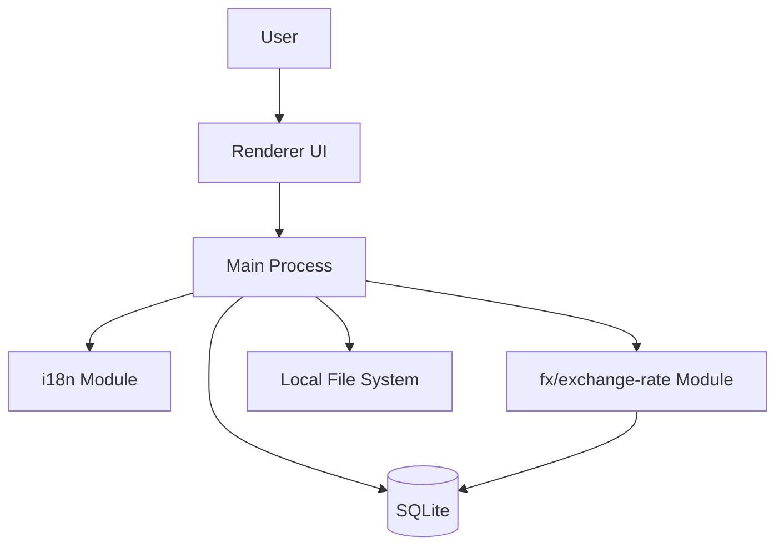
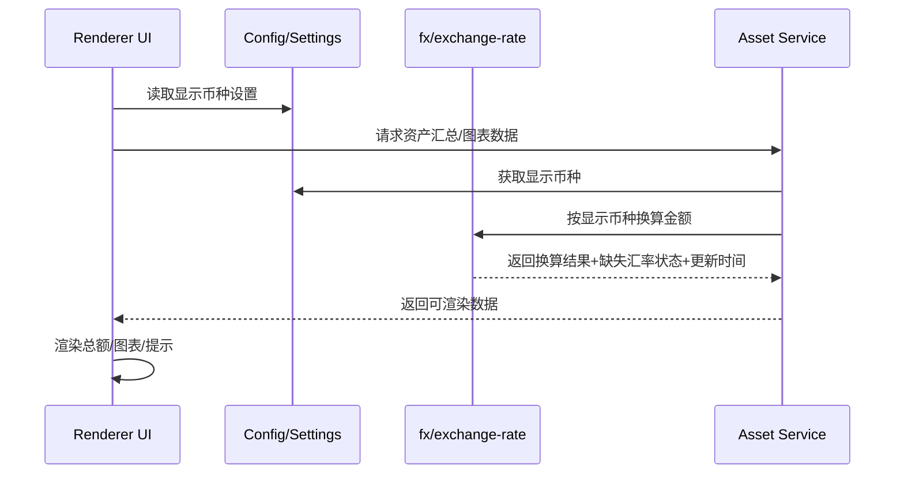
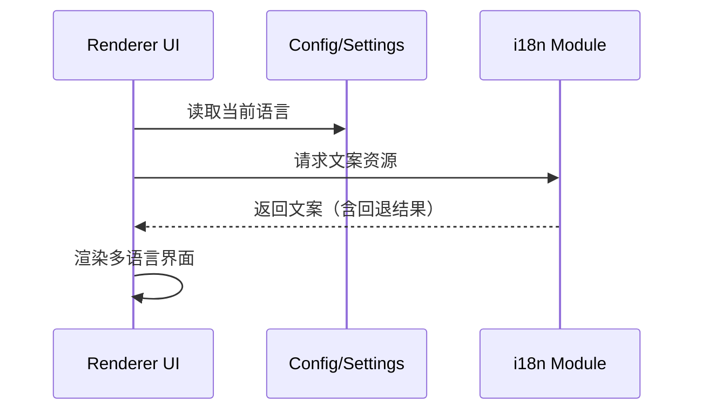
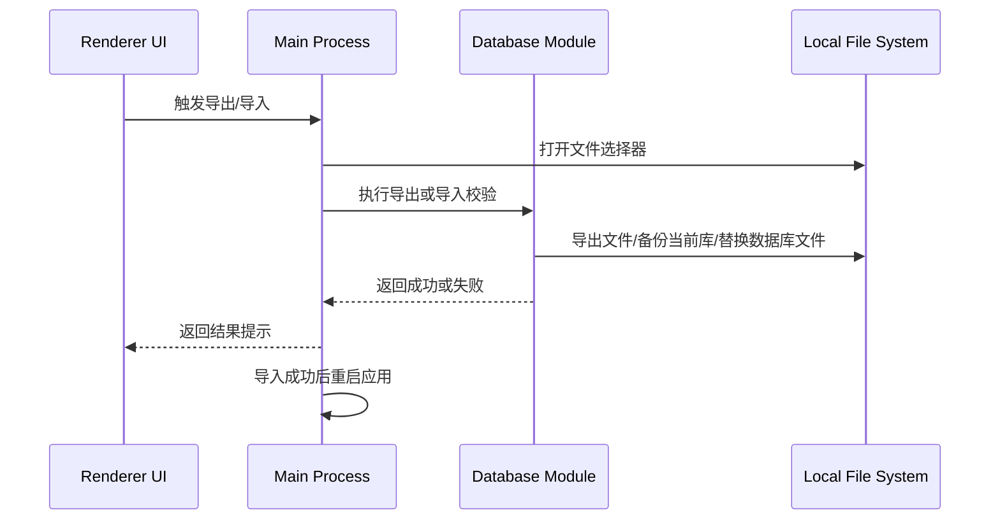

# 2️⃣ 系统架构设计书（High-Level Design, HLD）

版本：1.2  
作者：Tei  
日期：2026-02-15

## 1. 系统概述

### 1.1 系统目标

构建一个：

- 完全本地运行
- 不依赖互联网
- 可长期使用（20年以上）
- 数据可控、可迁移
- 支持资产管理、图表、导出与备份
- 支持多语言与多币种显示

### 1.2 技术选型（摘要）

| 组件 | 技术 |
| --- | --- |
| 桌面容器 | Electron |
| UI层 | React |
| 数据库 | SQLite（`sql.js`） |
| 图表 | Canvas API |
| 样式 | MVP.css + 自定义样式 |

## 2. 总体架构

### 2.1 架构说明

- Renderer 负责界面渲染与用户交互。
- Main 负责业务编排、配置读取、汇率查询、数据访问。
- `i18n` 模块负责语言选择、文案加载与回退规则。
- `fx/exchange-rate` 模块负责汇率读取、币种换算与状态判定。

## 3. 模块划分

### 3.1 UI 模块（Renderer）

职责：

- 页面渲染（Dashboard / Assets / Types / Chart）
- 语言切换入口
- 显示币种切换入口
- 展示汇率更新时间与缺失汇率提示
- 提供数据库导入/导出入口（设备迁移）

### 3.2 i18n 模块

职责：

- 管理可用语言列表（`zh-CN`、`en-US`、`ja-JP`）
- 提供默认语言（`en-US`）
- 持久化用户语言选择
- 执行缺失文案回退（`en-US` -> `zh-CN` -> key）

### 3.3 fx/exchange-rate 模块

职责：

- 维护支持币种列表（`JPY`、`CNY`、`USD`）
- 提供“记账币种 -> 显示币种”换算能力
- 输出汇率更新时间
- 判定“缺失汇率”并返回可展示状态

### 3.4 业务模块（Main / Service）

职责：

- 聚合资产数据
- 调用 i18n 与 fx 模块生成展示数据
- 向 UI 返回可直接渲染的结构（含提示状态）

### 3.5 数据模块（Data Access）

职责：

- 存取资产与资产类型
- 存取设置（语言、显示币种）
- 存取汇率表与更新时间
- 支持数据库文件导入/导出与迁移前备份

## 4. 关键数据流

### 4.1 多币种展示数据流

> 目标：定义 `UI -> 配置 -> 汇率服务 -> 渲染`

### 4.2 多语言渲染数据流

### 4.3 设备迁移数据流（导入/导出）

## 5. 离线策略

### 5.1 本地汇率表

- 汇率数据以本地表为准，不依赖在线实时接口。
- 系统展示“汇率更新时间”，让用户判断新鲜度。

### 5.2 手工更新

- 用户可在设置页直接维护/确认汇率值。
- 更新后立即影响后续展示换算结果。

### 5.3 缓存过期规则

- 汇率记录定义有效期（例如 N 天，具体值由配置定义）。
- 超过有效期标记为“已过期”，UI 需提示。
- 过期不等于不可用：
  - 若仍有可用汇率，可继续换算并提示“汇率已过期”；
  - 若缺失目标汇率，显示“缺少汇率”，相关金额不计入汇总。

### 5.4 数据迁移与备份策略

- 数据库版本采用 SQLite `PRAGMA user_version` 管理。
- 启动时先执行数据库迁移，再打开主窗口（避免旧 schema 直接被业务读写）。
- 迁移脚本目录：`main/migrations/`，命名规则：`NNN_description.sql`（如 `001_initial_schema.sql`）。
- 迁移执行前自动备份当前数据库文件到 `userData/backups/`。
- 每个迁移脚本在事务内执行（`BEGIN/COMMIT`），失败则 `ROLLBACK` 并终止启动。
- 数据库存储路径：
  - 开发环境：`data/assets.db`
  - 打包环境：`app.getPath('userData')/assets.db`

## 6. 非功能与约束

- 全功能可离线使用。
- 语言与显示币种设置需跨重启保持。
- 任何缺失翻译或缺失汇率必须可见提示，禁止静默失败。
- 架构优先可维护性：模块边界清晰、职责单一。
- 版本升级必须通过 migration 管理，禁止直接修改线上用户库结构。
