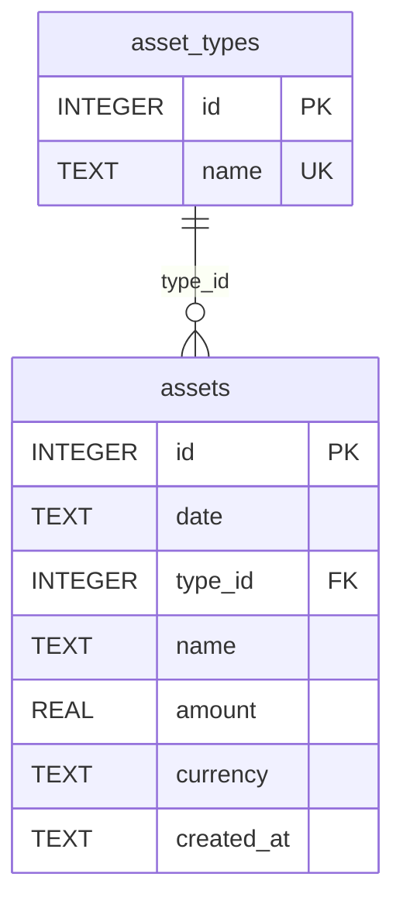

# 3️⃣ 数据库设计文档（DDL）

版本：1.2  
作者：Tei  
日期：2026-02-14

## 1. 文档目标

本文档描述当前程序实际使用的 SQLite 表结构（与 `main/database.js` 保持一致）。

## 2. 数据库文件

- 路径：`data/assets.db`
- 引擎：SQLite（通过 `sql.js`）

## 3. 表结构



## 4. 建表 SQL（实际实现）

```sql
CREATE TABLE IF NOT EXISTS asset_types (
  id INTEGER PRIMARY KEY AUTOINCREMENT,
  name TEXT UNIQUE NOT NULL
);

CREATE TABLE IF NOT EXISTS assets (
  id INTEGER PRIMARY KEY AUTOINCREMENT,
  date TEXT NOT NULL,
  type_id INTEGER,
  name TEXT,
  amount REAL DEFAULT 0,
  currency TEXT,
  created_at TEXT DEFAULT CURRENT_TIMESTAMP,
  FOREIGN KEY(type_id) REFERENCES asset_types(id)
);
```

## 5. 字段说明

## 5.1 `asset_types`

- `id`：主键，自增
- `name`：类型名称，唯一且非空

## 5.2 `assets`

- `id`：主键，自增
- `date`：资产日期（文本，页面使用 `type=date` 输入）
- `type_id`：资产类型 ID，可空，外键关联 `asset_types.id`
- `name`：资产名称，可空
- `amount`：金额，默认 `0`
- `currency`：币种（当前 UI 主要使用 `JPY` / `CNY`）
- `created_at`：创建时间，默认 `CURRENT_TIMESTAMP`

## 6. 约束与关系

- `asset_types.name` 唯一约束：防止重复类型名
- `assets.type_id` 外键约束：关联资产类型
- 业务层额外保护：删除类型前会检查是否被资产使用（见 `main/assetService.js`）

## 7. 与旧版 DDL 差异

以下字段在当前代码中尚未实现，已从“当前 DDL”中移除：

- `asset_types.color`
- `asset_types.sort_order`
- `asset_types.created_at`
- `asset_types.updated_at`
- `assets.memo`
- `assets.updated_at`
