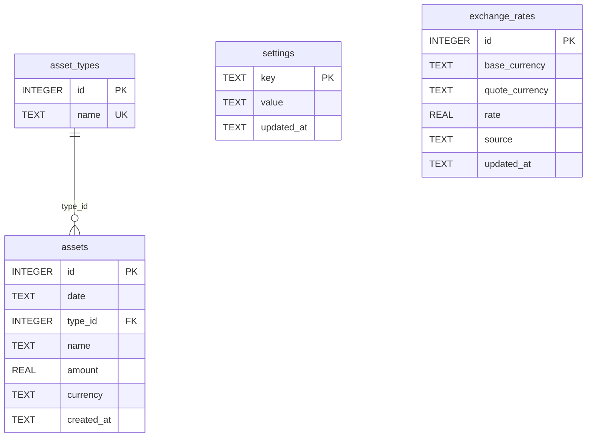

# 3️⃣ 数据库设计文档（DDL）

版本：1.3  
作者：Tei  
日期：2026-02-15

## 1. 文档目标

本文档定义与 HLD 一致的数据库模型术语与结构，重点覆盖：

- 资产数据（`assets`、`asset_types`）
- 系统设置（`settings`）
- 汇率数据（`exchange_rates`）

## 2. 数据库文件

- 路径（开发环境）：`data/assets.db`
- 路径（打包环境）：`app.getPath('userData')/assets.db`
- 自动备份目录：`app.getPath('userData')/backups/`
- 引擎：SQLite（`sql.js`）

## 2.1 Schema 版本管理

- 采用 SQLite `PRAGMA user_version` 记录当前 schema 版本。
- 迁移脚本来自 `main/migrations/NNN_*.sql`，按 `NNN` 升序执行。
- 每次升级迁移前创建备份文件：
  - `assets.v<from>-to-v<to>.<timestamp>.db`

## 3. ER 模型



## 4. 建表 SQL（目标结构）

```sql
CREATE TABLE IF NOT EXISTS asset_types (
  id INTEGER PRIMARY KEY AUTOINCREMENT,
  name TEXT UNIQUE NOT NULL
);

CREATE TABLE IF NOT EXISTS assets (
  id INTEGER PRIMARY KEY AUTOINCREMENT,
  date TEXT NOT NULL,
  type_id INTEGER,
  name TEXT,
  amount REAL DEFAULT 0,
  currency TEXT NOT NULL,
  created_at TEXT DEFAULT CURRENT_TIMESTAMP,
  FOREIGN KEY(type_id) REFERENCES asset_types(id)
);

CREATE TABLE IF NOT EXISTS settings (
  key TEXT PRIMARY KEY,
  value TEXT NOT NULL,
  updated_at TEXT NOT NULL DEFAULT CURRENT_TIMESTAMP
);

CREATE TABLE IF NOT EXISTS exchange_rates (
  id INTEGER PRIMARY KEY AUTOINCREMENT,
  base_currency TEXT NOT NULL,
  quote_currency TEXT NOT NULL,
  rate REAL NOT NULL,
  source TEXT NOT NULL DEFAULT 'manual',
  updated_at TEXT NOT NULL DEFAULT CURRENT_TIMESTAMP,
  UNIQUE(base_currency, quote_currency)
);
```

## 5. 索引建议

```sql
CREATE INDEX IF NOT EXISTS idx_assets_date ON assets(date DESC);
CREATE INDEX IF NOT EXISTS idx_assets_currency ON assets(currency);
CREATE INDEX IF NOT EXISTS idx_exchange_rates_pair ON exchange_rates(base_currency, quote_currency);
```

## 6. 关键字段约定

### 6.1 `settings.key` 约定键

- `app.language`: 当前语言（如 `en-US`）
- `app.display_currency`: 显示币种（如 `USD`）
- `fx.cache_ttl_days`: 汇率有效期天数

### 6.2 `exchange_rates` 字段语义

- `base_currency` / `quote_currency`: 汇率方向（1 base = rate quote）
- `source`: 来源标识（例如 `manual`）
- `updated_at`: 汇率更新时间（用于判断新鲜度）

## 7. 数据质量约束

- `assets.currency` 必须在支持币种集合内。
- 当前支持币种：`JPY`、`CNY`、`USD`。
- `exchange_rates.rate` 必须大于 0。
- 同一币种对仅允许一条记录（`UNIQUE(base_currency, quote_currency)`）。

## 8. 示例数据

```sql
INSERT INTO settings(key, value) VALUES
  ('app.language', 'en-US'),
  ('app.display_currency', 'USD'),
  ('fx.cache_ttl_days', '90');

INSERT INTO exchange_rates(base_currency, quote_currency, rate, source)
VALUES
  ('CNY', 'JPY', 22.222222, 'manual');
```

## 9. 兼容说明

- `assets` / `asset_types` 保持兼容现有业务。
- `settings` / `exchange_rates` 为多语言与多币种能力新增的核心表。
- schema 演进通过 migration 脚本推进，不允许手工直接改线上库结构。
- 数据库导入/导出能力不新增业务表结构，基于现有 `assets.db` 文件迁移。
