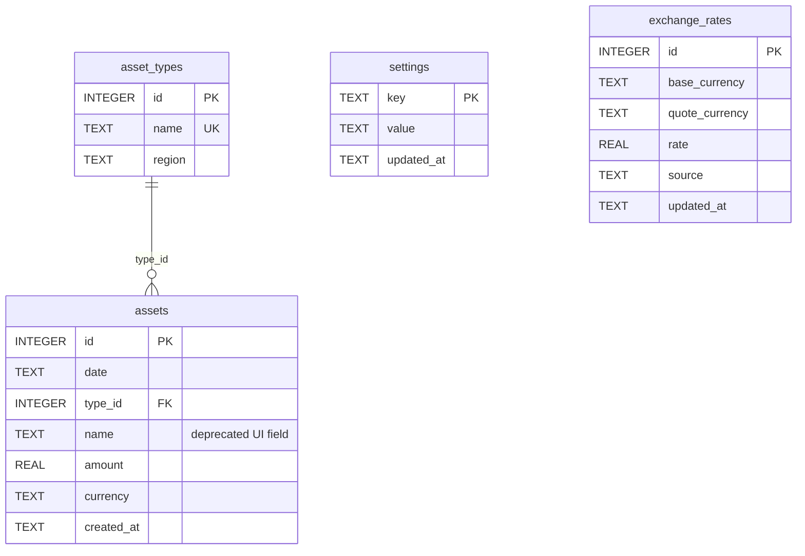

# 3️⃣ 数据库设计文档（DDL）

版本：1.4  
作者：Tei  
日期：2026-07-16

## 1. 文档目标

本文档定义与 HLD 一致的数据库模型术语与结构，重点覆盖：

- 资产数据（`assets`、`asset_types`）
- 资产类型 Region（`asset_types.region`）
- 系统设置（`settings`）
- 汇率数据（`exchange_rates`）
- Rebalance 快照使用方式

## 2. 数据库文件

- 路径（开发环境）：`data/assets.db`
- 路径（打包环境）：`app.getPath('userData')/assets.db`
- 自动备份目录：`app.getPath('userData')/backups/`
- 引擎：SQLite（`sql.js`）

## 2.1 Schema 版本管理

- 采用 SQLite `PRAGMA user_version` 记录当前 schema 版本。
- 迁移脚本来自 `main/migrations/NNN_*.sql`，按 `NNN` 升序执行。
- 每次升级迁移前创建备份文件：
  - `assets.v<from>-to-v<to>.<timestamp>.db`

## 3. ER 模型


```mermaid
erDiagram
  asset_types {
    INTEGER id PK
    TEXT name UK
    TEXT region
  }

  assets {
    INTEGER id PK
    TEXT date
    INTEGER type_id FK
    TEXT name "deprecated UI field"
    REAL amount
    TEXT currency
    TEXT created_at
  }

  settings {
    TEXT key PK
    TEXT value
    TEXT updated_at
  }

  exchange_rates {
    INTEGER id PK
    TEXT base_currency
    TEXT quote_currency
    REAL rate
    TEXT source
    TEXT updated_at
  }

  asset_types ||--o{ assets : "type_id"
```

## 4. 建表 SQL（目标结构）

```sql
CREATE TABLE IF NOT EXISTS asset_types (
  id INTEGER PRIMARY KEY AUTOINCREMENT,
  name TEXT UNIQUE NOT NULL,
  region TEXT
);

CREATE TABLE IF NOT EXISTS assets (
  id INTEGER PRIMARY KEY AUTOINCREMENT,
  date TEXT NOT NULL,
  type_id INTEGER,
  name TEXT,
  amount REAL DEFAULT 0,
  currency TEXT NOT NULL,
  created_at TEXT DEFAULT CURRENT_TIMESTAMP,
  FOREIGN KEY(type_id) REFERENCES asset_types(id)
);

CREATE TABLE IF NOT EXISTS settings (
  key TEXT PRIMARY KEY,
  value TEXT NOT NULL,
  updated_at TEXT NOT NULL DEFAULT CURRENT_TIMESTAMP
);

CREATE TABLE IF NOT EXISTS exchange_rates (
  id INTEGER PRIMARY KEY AUTOINCREMENT,
  base_currency TEXT NOT NULL,
  quote_currency TEXT NOT NULL,
  rate REAL NOT NULL,
  source TEXT NOT NULL DEFAULT 'manual',
  updated_at TEXT NOT NULL DEFAULT CURRENT_TIMESTAMP,
  UNIQUE(base_currency, quote_currency)
);
```

## 5. 迁移 SQL（vNext）

### 5.1 `asset_types.region`

```sql
ALTER TABLE asset_types ADD COLUMN region TEXT;
```

迁移要求：

- 仅当 `asset_types` 不存在 `region` 字段时执行。
- 迁移前自动备份数据库。
- 旧资产类型的 `region` 默认为 `NULL` 或空值。
- 迁移不得修改 `assets` 历史数据。

### 5.2 `assets.name` 兼容策略

第一阶段不执行：

```sql
-- 不在本次变更执行
-- ALTER TABLE assets DROP COLUMN name;
```

原因：

- 保持旧数据库和导入文件兼容。
- 避免破坏历史数据。
- UI 层停止展示、编辑和依赖该字段即可满足需求。

## 6. 索引建议

```sql
CREATE INDEX IF NOT EXISTS idx_assets_date ON assets(date DESC);
CREATE INDEX IF NOT EXISTS idx_assets_currency ON assets(currency);
CREATE INDEX IF NOT EXISTS idx_assets_type_id ON assets(type_id);
CREATE INDEX IF NOT EXISTS idx_asset_types_region ON asset_types(region);
CREATE INDEX IF NOT EXISTS idx_exchange_rates_pair ON exchange_rates(base_currency, quote_currency);
```

## 7. 关键字段约定

### 7.1 `asset_types.region`

- 表示资产类型所属地区或市场。
- 第一阶段为自由文本。
- 可为空。
- 示例：`Japan`、`China`、`US`、`Global`、`日本`、`中国`。

### 7.2 `assets.name`

- 历史兼容字段。
- 用户界面不再展示、不再编辑。
- 新增资产和 Rebalance 保存时可写入空字符串或 `NULL`。
- 不参与 Dashboard、Chart、Rebalance 的核心计算。

### 7.3 `assets.date`

- 表示资产快照日期。
- Dashboard 当前资产取最新日期的资产集合。
- Rebalance 保存会插入一组同日期的新快照记录。

### 7.4 `settings.key` 约定键

- `app.language`: 当前语言（如 `en-US`）
- `app.display_currency`: 显示币种（如 `USD`）
- `fx.cache_ttl_days`: 汇率有效期天数

### 7.5 `exchange_rates` 字段语义

- `base_currency` / `quote_currency`: 汇率方向（1 base = rate quote）
- `source`: 来源标识（例如 `manual`）
- `updated_at`: 汇率更新时间（用于判断新鲜度）

## 8. 数据质量约束

- `assets.currency` 必须在支持币种集合内。
- 当前支持币种：`JPY`、`CNY`、`USD`。
- `exchange_rates.rate` 必须大于 0。
- 同一币种对仅允许一条记录（`UNIQUE(base_currency, quote_currency)`）。
- Rebalance 保存时，同一批草稿必须有合法日期和合法金额。
- `asset_types.name` 仍保持唯一。
- `asset_types.region` 不要求唯一。

## 9. Rebalance 数据表示

Rebalance 不新增独立业务表。它通过 `assets.date` 表示一组资产快照：

- 读取最新 `assets.date` 的资产集合作为模板。
- 保存时插入新 `date` 下的一组 `assets` 记录。
- Dashboard 和 Chart 继续按日期聚合。

示例：

```sql
-- 上一次快照
SELECT * FROM assets WHERE date = '2026-07-12';

-- Rebalance 保存后产生新快照
INSERT INTO assets(date, type_id, name, amount, currency)
VALUES
  ('2026-07-16', 1, NULL, 2500000, 'JPY'),
  ('2026-07-16', 2, NULL, 120000, 'CNY');
```

## 10. 示例数据

```sql
INSERT INTO settings(key, value) VALUES
  ('app.language', 'en-US'),
  ('app.display_currency', 'USD'),
  ('fx.cache_ttl_days', '90');

INSERT INTO asset_types(name, region) VALUES
  ('US Stocks', 'US'),
  ('China Stocks', 'China'),
  ('JPY Cash', 'Japan');

INSERT INTO exchange_rates(base_currency, quote_currency, rate, source)
VALUES
  ('CNY', 'JPY', 22.222222, 'manual');
```

## 11. 兼容说明

- `assets.name` 保留为兼容字段，UI 不再使用。
- `asset_types.region` 为新增字段，通过 migration 添加。
- `settings` / `exchange_rates` 为多语言与多币种能力核心表。
- Rebalance 不新增表，复用 `assets.date` 快照模型。
- schema 演进通过 migration 脚本推进，不允许手工直接改线上库结构。
- 数据库导入/导出能力基于完整 `assets.db` 文件迁移，导入旧库后需执行最新 migration。
