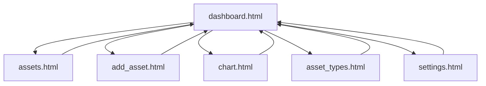

# 5️⃣ UI 设计文档

版本：1.6  
作者：Tei  
日期：2026-02-15

## 1. 文档目标

本文件描述当前 UI（含设置页）的交互设计，重点覆盖：

- 语言切换入口
- 显示币种入口
- 汇率维护与 FX 状态提示
- 数据导入/导出入口（设备迁移）

## 2. UI 技术栈

| 项目 | 技术 |
|---|---|
| 页面 | HTML5 |
| 样式 | `mvp.css` + 页面内联样式 |
| 脚本 | React 18（`renderer/app-react.js`） |
| React 运行时 | `renderer/vendor/react.production.min.js`、`renderer/vendor/react-dom.production.min.js` |
| JSX 转译 | `renderer/vendor/babel.min.js` |
| 图表 | Canvas API（在 React 组件内绘制） |

## 3. 页面清单

```text
renderer/
├─ dashboard.html
├─ assets.html
├─ add_asset.html
├─ asset_types.html
├─ chart.html
└─ settings.html
```

## 4. 导航结构



说明：顶部导航在所有页面统一显示，链接顺序为  
`Dashboard` / `View Assets` / `Add Asset` / `View Chart` / `Asset Types` / `Settings`。

## 5. 页面设计

## 5.1 Dashboard（`DashboardPage`）

- 显示总资产（按 display currency）
- 显示最近资产表
- 显示 FX 状态摘要（`OK/STALE/MISSING`）与更新时间
- `MISSING` 时显示 `(partial)` 标记

## 5.2 Assets / Add Asset

- 资产币种可选：`JPY`、`CNY`、`USD`
- 支持新增、编辑、删除、Duplicate
- Assets 页支持分页（上一页/下一页）
- Add Asset 的金额输入步长为 `1`

## 5.3 Asset Types（`AssetTypesPage`）

- 支持新增、编辑、删除资产类型
- 表格使用与 Assets 页一致的紧凑行高与按钮尺寸
- 支持分页（上一页/页码链接/下一页）

## 5.4 Chart（`ChartPage`）

- 按设置中的 display currency 进行金额换算并绘制
- 图表标题与 Y 轴单位显示当前 display currency

## 5.5 Settings（`SettingsPage`）

Settings 页是语言/币种/汇率唯一配置入口。

### A. 语言切换入口

- 组件：`Language` 下拉
- 可选项：`zh-CN`、`en-US`、`ja-JP`
- 行为：保存到数据库 `settings.app.language`

### B. 显示币种入口

- 组件：`Display Currency` 下拉
- 可选项：`JPY`、`CNY`、`USD`
- 行为：保存到数据库 `settings.app.display_currency`

### C. 汇率维护入口（新增）

- 组件：手工输入表格 + 保存按钮
- 支持维护的币种对：
  - `CNY -> JPY`
  - `USD -> JPY`
  - `USD -> CNY`
- 行为：点击 `Save Rates`（中文：`保存汇率`）后写入 `exchange_rates` 表
- 表格中显示各币种对 `updated_at`
- 汇率输入步长：`0.1`

### D. 缓存策略入口

- 组件：`FX Cache TTL (days)` 数字输入
- 行为：保存到数据库 `settings.fx.cache_ttl_days`

### E. 数据迁移入口（新增）

- 组件：`Export Data` / `Import Data` 两个按钮
- 位置：Settings 页面汇率配置区下方
- 导出行为：
  - 点击后打开保存路径选择器
  - 导出当前数据库到用户指定 `.db` 文件
  - 页面显示导出成功路径
- 导入行为：
  - 点击后先弹出“覆盖当前数据并重启”确认
  - 确认后打开文件选择器导入 `.db`
  - 导入成功后页面提示并自动重启应用
  - 导入失败时显示错误信息，不改变当前数据

## 6. FX 状态提示（用户可见）

### 6.1 状态定义

- `OK`：所需汇率齐全且未过期
- `STALE`：汇率齐全但超过 TTL
- `MISSING`：存在缺失汇率，部分资产未计入

### 6.2 展示位置

- Dashboard 总资产区域下方（摘要）
- Settings 汇率表中通过更新时间辅助判断

### 6.3 文案示例

- `FX: OK · updated: 2026-02-15 09:30`
- `FX: STALE · updated: 2026-02-01 09:30`
- `FX: MISSING · excluded: 2`

## 7. 交互原型示意

```text
+------------------------------------------------------------------+
| Settings                                                         |
+------------------------------------------------------------------+
| Language:          [ zh-CN v ]                                   |
| Display Currency:  [ JPY v ]                                     |
| FX Cache TTL(days): [ 7 ]                                        |
| [ Save Settings ]                                                |
|------------------------------------------------------------------|
| Exchange Rates (Manual)                                          |
| Pair         | Rate input      | Updated At                      |
| CNY->JPY     | [ 22.22      ]  | 2026-02-15 09:30               |
| USD->JPY     | [ 150.00     ]  | 2026-02-15 09:30               |
| USD->CNY     | [ 7.20       ]  | 2026-02-15 09:30               |
| [ Save Rates ]                                                   |
+------------------------------------------------------------------+
```

## 8. 验收要点（UI 视角）

1. 在 Settings 修改语言并保存后，重启应用仍保持该语言。  
2. 在 Settings 修改 display currency 并保存后，Dashboard/Chart 显示同步变化。  
3. 在 Settings 修改汇率并保存后，Dashboard/Chart 计算结果实时可见变化。  
4. 币种选项只出现 `JPY/CNY/USD`，不出现 `HKD/EUR`。  
5. 汇率缺失时，Dashboard 显示 `MISSING` 与排除条目提示。
6. 在 Settings 可见 `Export Data` 与 `Import Data` 按钮。  
7. 导入前必须出现覆盖确认提示；导入成功后应用自动重启。  
8. 导入失败时页面可见错误提示，且原有数据保持不变。  
