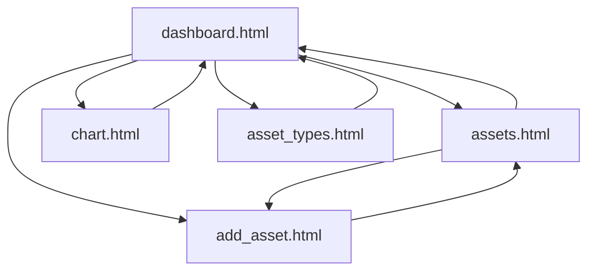

# 5️⃣ UI 设计文档

版本：1.3  
作者：Tei  
日期：2026-02-14

## 1. 文档目标

本文件描述当前已实现 UI 页面、导航与交互行为，确保与 `renderer/` 下实际代码一致。

## 2. UI 技术栈

| 项目 | 技术 |
|---|---|
| 页面 | HTML5 |
| 样式 | `mvp.css` + 页面内联样式 |
| 脚本 | React 18（`renderer/app-react.js`） |
| React 运行时 | 本地静态文件（`renderer/vendor/react.production.min.js`、`renderer/vendor/react-dom.production.min.js`） |
| 图表 | Canvas API（在 React 组件内绘制） |
| 运行环境 | Electron Renderer |

## 3. 页面清单（实际存在）

```text
renderer/
├─ dashboard.html
├─ assets.html
├─ add_asset.html
├─ asset_types.html
└─ chart.html
```

> 当前没有独立的 `asset_modify.html`、`asset_type_modify.html`、`add_asset_type.html` 页面；编辑/新增能力已内嵌在现有页面。

## 4. 导航结构



## 5. React 页面设计

## 5.1 Dashboard（`dashboard.html` / `DashboardPage`）

### 目标

- 显示最新日期资产总额（JPY）
- 提供主导航
- 显示最近资产表格

### 数据行为

- 调用 `window.api.getLatestAssets()`
- 调用 `window.api.getConfig()` 读取 `JPY_PER_CNY`
- 将 CNY 按比例换算为 JPY 后显示总额
- 表格展示字段：Date / Type / Name / Amount / Currency

## 5.2 Assets（`assets.html` / `AssetsPage`）

### 目标

- 查看资产列表
- 执行 Duplicate / Edit / Delete
- 跳转新增资产

### Actions 行为

- `Duplicate`：复制当前行数据到 `sessionStorage.prefillAsset`，跳转 `add_asset.html`
- `Edit`：打开内联编辑区域并回填数据
- `Delete`：删除后刷新列表

## 5.3 Add Asset（`add_asset.html` / `AddAssetPage`）

### 目标

- 新增资产
- 接收 Duplicate 的预填数据

### 表单字段

- Date（`type=date`）
- Type（下拉，来自 `getAssetTypes`）
- Name
- Amount
- Currency（JPY/CNY）

### 提交行为

- 调用 `window.api.addAsset({ date, typeId, name, amount, currency })`
- 成功后跳转 `assets.html`

## 5.4 Asset Types（`asset_types.html` / `AssetTypesPage`）

### 目标

- 资产类型的新增、编辑、删除

### Actions 行为

- `Edit`：打开内联编辑面板
- `Delete`：先确认，再调用删除
  - 若后端返回 `{ error }`，弹窗显示错误
  - 否则刷新列表

## 5.5 Chart（`chart.html` / `ChartPage`）

### 目标

- 以柱状图展示按日期聚合后的资产总额（JPY）

### 绘图行为

- 数据来源：`getAssets()`
- 规则：按日期聚合；CNY 转 JPY；JPY 原值累加
- 绘制内容：网格线、Y 轴刻度、柱子、柱顶数值、X 轴日期、标题与 Y 轴文字

## 6. 通用交互与状态

- 每个页面 HTML 仅提供 `#root`，由 React 挂载
- `app-react.js` 根据当前页面文件名选择对应组件
- 变更后统一采用“重新拉取列表并重渲染”策略
- 删除类型时使用 `confirm` 二次确认
- 业务错误主要通过 `alert` 展示

## 7. 样式说明

- 基础风格采用 MVP.css
- 各页面继续保留少量内联样式（边距、表格、导航布局）

## 8. 与旧版实现差异

- Renderer 从 Vanilla JS 迁移为 React 组件渲染
- 旧 `renderer/renderer.js` 逻辑已由 `renderer/app-react.js` 接管
- 页面功能保持不变：CRUD、Duplicate、内联编辑、图表与汇率换算
