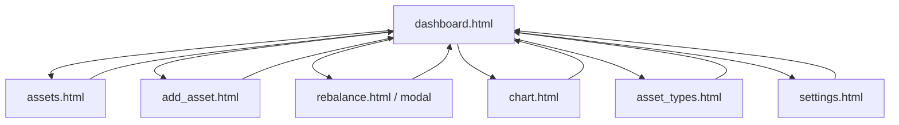

# 5️⃣ UI 设计文档

版本：1.7  
作者：Tei  
日期：2026-07-16

## 1. 文档目标

本文件描述当前 UI（含设置页与 Rebalance）的交互设计，重点覆盖：

- 语言切换入口
- 显示币种入口
- 汇率维护与 FX 状态提示
- 数据导入/导出入口（设备迁移）
- Asset Name 从 UI 删除
- Asset Type Region 的新增/编辑
- Dashboard `Add New Rebalance` 交互
- Settings 保存反馈

## 2. UI 技术栈

| 项目 | 技术 |
|---|---|
| 页面 | HTML5 |
| 样式 | `mvp.css` + 自定义样式 |
| 脚本 | React 18（`renderer/app-react.js`） |
| React 运行时 | `renderer/vendor/react.production.min.js`、`renderer/vendor/react-dom.production.min.js` |
| JSX 转译 | `renderer/vendor/babel.min.js` |
| 图表 | Canvas API（在 React 组件内绘制） |

## 3. 页面清单

```text
renderer/
├─ dashboard.html
├─ assets.html
├─ add_asset.html
├─ asset_types.html
├─ chart.html
├─ settings.html
└─ rebalance.html        # 规划：也可实现为 Dashboard 内 modal/section
```

## 4. 导航结构


```mermaid
flowchart TD
  dashboard[dashboard.html] --> assets[assets.html]
  dashboard --> addAsset[add_asset.html]
  dashboard --> rebalance[rebalance.html / modal]
  dashboard --> chart[chart.html]
  dashboard --> types[asset_types.html]
  dashboard --> settings[settings.html]
  assets --> dashboard
  addAsset --> dashboard
  rebalance --> dashboard
  chart --> dashboard
  types --> dashboard
  settings --> dashboard
```

说明：顶部导航在所有页面统一显示，链接顺序为  
`Dashboard` / `Assets` / `Add Asset` / `Charts` / `Asset Types` / `Settings`。

## 5. 页面设计

## 5.1 Dashboard（`DashboardPage`）

- 显示总资产（按 display currency）。
- 显示当前资产表，数据来自最新日期资产快照。
- 当前资产表不显示 Asset Name。
- 显示 FX 状态摘要（`OK/STALE/MISSING`）与更新时间。
- 更新时间在所有页面统一显示为日期格式 `YYYY-MM-DD`，不显示具体时分秒。
- `MISSING` 时显示 `(partial)` 标记。
- 显示 `Add New Rebalance` 按钮。

### Add New Rebalance 按钮

- 位置：Dashboard 主操作区或总资产卡片附近。
- 状态：
  - 有历史资产：按钮可点击。
  - 无历史资产：按钮不可用或显示空状态引导。
- 行为：点击后进入 Rebalance 草稿界面。

## 5.2 Rebalance 草稿界面

Rebalance 可实现为独立页面或 Dashboard 内 modal/section，用户可见行为一致。

### 草稿内容

- 默认日期：当天日期。
- 行数据：复制最新日期资产快照。
- 每行显示：资产类型、Region、币种、金额输入。
- 不显示 Asset Name。

### 可编辑字段

- Rebalance 日期。
- 每个资产的金额。

### 操作按钮

- `Save Rebalance`
- `Cancel`

### 保存行为

- 校验日期与金额。
- 保存时禁用按钮，避免重复提交。
- 成功后插入新日期资产快照。
- 成功后跳转 Dashboard 或显示成功反馈。
- 失败时显示错误反馈，不修改上一期快照。

## 5.3 Assets / Add Asset

- 资产币种可选：`JPY`、`CNY`、`USD`。
- 支持新增、编辑、删除、Duplicate。
- Assets 页支持分页（上一页/下一页）。
- Add Asset 的金额输入步长为 `1`。
- Add Asset 不显示 Name 输入。
- Edit Asset 不显示 Name 输入。
- Assets 列表不显示 Name 列。
- Duplicate 行为复制日期、资产类型、金额、币种，不依赖 Name。

## 5.4 Asset Types（`AssetTypesPage`）

- 支持新增、编辑、删除资产类型。
- 支持 Region 字段。
- 表格列：ID、Name、Region、Actions。
- 新增表单字段：Name、Region。
- 编辑表单字段：Name、Region。
- Region 可为空。
- Region 支持中文、英文、日文输入。
- 表格使用与 Assets 页一致的紧凑行高与按钮尺寸。
- 支持分页（上一页/页码链接/下一页）。

## 5.5 Chart（`ChartPage`）

- 按设置中的 display currency 进行金额换算并绘制。
- 图表标题与 Y 轴单位显示当前 display currency。
- 保存 Rebalance 后，Chart 应显示新日期柱状图。
- 图表不显示 Asset Name。

## 5.6 Settings（`SettingsPage`）

Settings 页是语言/币种/汇率唯一配置入口。

### A. 语言切换入口

- 组件：`Language` 下拉。
- 可选项：`zh-CN`、`en-US`、`ja-JP`。
- 行为：保存到数据库 `settings.app.language`。
- 保存后显示成功或失败反馈。

### B. 显示币种入口

- 组件：`Display Currency` 下拉。
- 可选项：`JPY`、`CNY`、`USD`。
- 行为：保存到数据库 `settings.app.display_currency`。
- 保存后显示成功或失败反馈。

### C. 汇率维护入口

- 组件：手工输入表格 + 保存按钮。
- 支持维护的币种对：
  - `CNY -> JPY`
  - `USD -> JPY`
  - `USD -> CNY`
- 行为：点击 `Save FX Rates`（中文：`保存汇率`）后写入 `exchange_rates` 表。
- 保存后显示成功或失败反馈。
- 表格中显示各币种对 `updated_at`，界面只展示日期部分 `YYYY-MM-DD`。
- 汇率输入步长：`0.1`。

### D. 缓存策略入口

- 组件：`FX Cache TTL (days)` 数字输入。
- 行为：保存到数据库 `settings.fx.cache_ttl_days`。

### E. 数据迁移入口

- 组件：`Export Data` / `Import Data` 两个按钮。
- 位置：Settings 页面汇率配置区下方。
- 导出行为：
  - 点击后打开保存路径选择器。
  - 导出当前数据库到用户指定 `.db` 文件。
  - 页面显示导出成功路径。
- 导入行为：
  - 点击后先弹出“覆盖当前数据并重启”确认。
  - 确认后打开文件选择器导入 `.db`。
  - 导入成功后页面提示并自动重启应用。
  - 导入失败时显示错误信息，不改变当前数据。

## 6. FX 状态提示（用户可见）

### 6.1 状态定义

- `OK`：所需汇率齐全且未过期。
- `STALE`：汇率齐全但超过 TTL。
- `MISSING`：存在缺失汇率，部分资产未计入。

### 6.2 展示位置

- Dashboard 总资产区域下方（摘要）。
- Settings 汇率表中通过更新时间辅助判断。
- 页脚状态区显示 FX 当前状态。

### 6.3 文案示例

- `FX: OK · updated: 2026-02-15`
- `FX: STALE · updated: 2026-02-01`
- `FX: MISSING · excluded: 2`

## 7. 交互原型示意

### 7.1 Settings

```text
+------------------------------------------------------------------+
| Settings                                                         |
+------------------------------------------------------------------+
| Preferences                                                      |
| Language:          [ zh-CN v ]                                   |
| Display Currency:  [ JPY v ]                                     |
| FX Cache TTL(days): [ 90 ]                                       |
| [ Save Preferences ]                                             |
| ✓ Preferences saved.                                             |
|------------------------------------------------------------------|
| Exchange Rates (Manual)                                          |
| Pair         | Rate input      | Updated At                      |
| CNY->JPY     | [ 22.22      ]  | 2026-02-15 09:30               |
| USD->JPY     | [ 150.00     ]  | 2026-02-15 09:30               |
| USD->CNY     | [ 7.20       ]  | 2026-02-15 09:30               |
| [ Save FX Rates ]                                                |
| ✓ FX rates saved.                                                |
|------------------------------------------------------------------|
| Local Data                                                       |
| [ Export Data ]  [ Import Data ]                                 |
+------------------------------------------------------------------+
```

### 7.2 Add New Rebalance

```text
+------------------------------------------------------------------+
| Dashboard                                                        |
| [ Add New Rebalance ]                                            |
+------------------------------------------------------------------+

Click ->

+------------------------------------------------------------------+
| Add New Rebalance                                                |
| Source snapshot: 2026-07-12                                      |
| Rebalance date: [ 2026-07-16 ]                                   |
|------------------------------------------------------------------|
| Type              | Region | Currency | Latest Amount             |
| US Stocks         | US     | USD      | [ 120000      ]           |
| China Stocks      | China  | CNY      | [ 32000       ]           |
| JPY Cash          | Japan  | JPY      | [ 260000      ]           |
|------------------------------------------------------------------|
| [ Save Rebalance ] [ Cancel ]                                    |
+------------------------------------------------------------------+
```

### 7.3 Asset Types with Region

```text
+------------------------------------------------------------------+
| Asset Types                                                      |
+------------------------------------------------------------------+
| Name:   [ US Stocks ]                                            |
| Region: [ US        ]                                            |
| [ Add Type ]                                                     |
|------------------------------------------------------------------|
| ID | Name          | Region | Actions                           |
| 1  | US Stocks     | US     | [ Edit ] [ Delete ]               |
| 2  | China Stocks  | China  | [ Edit ] [ Delete ]               |
+------------------------------------------------------------------+
```

## 8. 验收要点（UI 视角）

1. Dashboard、Assets、Add/Edit Asset 均不显示 Asset Name。  
2. Asset Types 可新增、编辑、展示 Region。  
3. Region 可为空，且支持中文/日文输入。  
4. Dashboard 可见 `Add New Rebalance` 按钮。  
5. Rebalance 草稿复制最新日期资产，日期默认当天。  
6. Rebalance 保存后 Dashboard 与 Chart 更新到新日期快照。  
7. Settings 修改语言并保存后，重启应用仍保持该语言。  
8. Settings 修改 display currency 并保存后，Dashboard/Chart 显示同步变化。  
9. Settings 修改汇率并保存后，Dashboard/Chart 计算结果实时可见变化。  
10. Settings 的 `Save Preferences` 和 `Save FX Rates` 都有成功/失败反馈。  
11. 币种选项只出现 `JPY/CNY/USD`，不出现 `HKD/EUR`。  
12. 汇率缺失时，Dashboard 显示 `MISSING` 与排除条目提示。  
13. Settings 可见 `Export Data` 与 `Import Data` 按钮。  
14. 导入前必须出现覆盖确认提示；导入成功后应用自动重启。  
15. 导入失败时页面可见错误提示，且原有数据保持不变。
